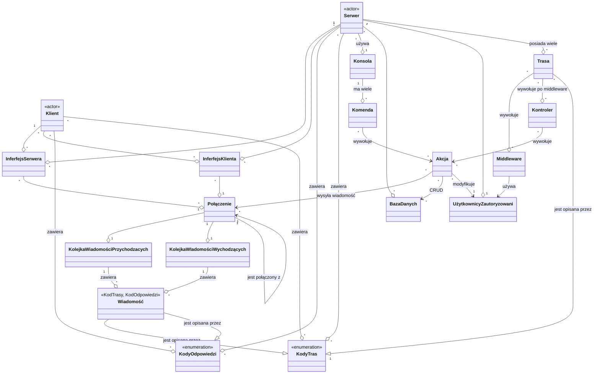

# About

```mermaid
classDiagram
    direction TB

    Serwer "1" --o "*" InferfejsSerwera
    Serwer "*" --o "*" InferfejsKlienta
    Klient "1" --o "*" InferfejsSerwera
    Klient "*" --o "*" InferfejsKlienta


    Serwer "*" --o "*"KodyOdpowiedzi : zawiera
    Klient "*" --o "*"KodyOdpowiedzi : zawiera
    Serwer "*" --o "*"KodyTras : zawiera
    Klient "*" --o "*"KodyTras : zawiera
    Akcja "*" --> "*" Połączenie : wysyła wiadomość
    

    InferfejsKlienta "*" --o "1" Połączenie
    InferfejsSerwera "*" --o "*" Połączenie

    Połączenie "1" --o "1" KolejkaWiadomościPrzychodzacych
    Połączenie "1" --o "1" KolejkaWIadomościWychodzących

    Połączenie "1" --> "1" Połączenie : jest połączony z

    KolejkaWiadomościPrzychodzacych "1" --o "*" Wiadomość : zawiera
    KolejkaWIadomościWychodzących "1" --o "*" Wiadomość : zawiera

    Serwer "*" --o "1" Konsola : używa
    Konsola "1" --o "*" Komenda : ma wiele
    Komenda "*" --> "*" Akcja : wywołuje
    

    Serwer "*" --o "*" BazaDanych
    Serwer "*" --o "1" UżytkownicyZautoryzowani

    Serwer "*" --o "*" Trasa : posiada wiele
    Trasa "*" --o "*" Middleware : wywołuje
    Trasa "*" --o "*" Kontroler : wywołuje po middleware
    Trasa "*" --|> "1" KodyTras : jest opisana przez
    Middleware --> UżytkownicyZautoryzowani : używa
    Kontroler "*" --> "*" Akcja : wywołuje
    
    Akcja "*" --> "*" BazaDanych : CRUD
    
    Akcja "*" --> "1" UżytkownicyZautoryzowani : modyfikuje

    Wiadomość --|> KodyTras : jest opisana przez
    Wiadomość --|> KodyOdpowiedzi : jest opisana przez

    class Serwer { <<actor>> }
    class Klient { <<actor>> }

    class KodyTras { <<enumeration>> }
    class KodyOdpowiedzi { <<enumeration>> }
    class Wiadomość { <<KodTrasy, KodOdpowiedzi>>}
    class InferfejsSerwera
    class InferfejsKlienta
    class KolejkaWiadomościPrzychodzacych
    class KolejkaWIadomościWychodzących
    class Połączenie
    class Trasa
    class BazaDanych
    class Middleware
    class Konsola
    class UżytkownicyZautoryzowani
    class Kontroler
    class Komenda
    class Akcja
```
